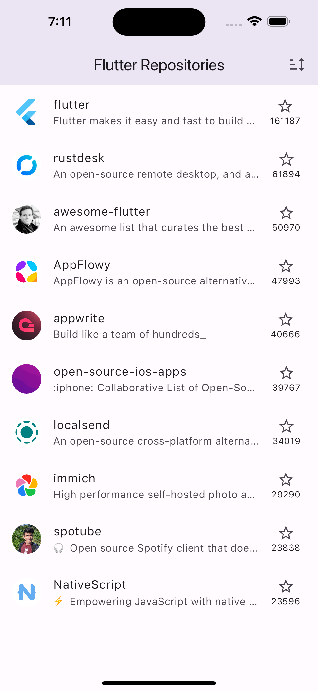
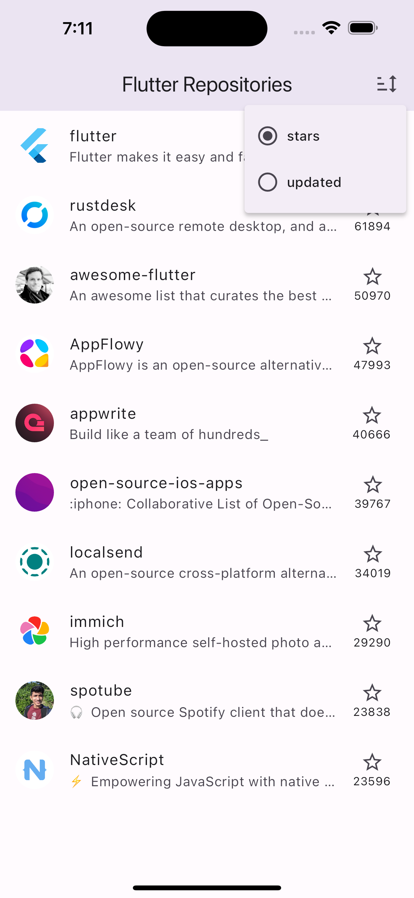
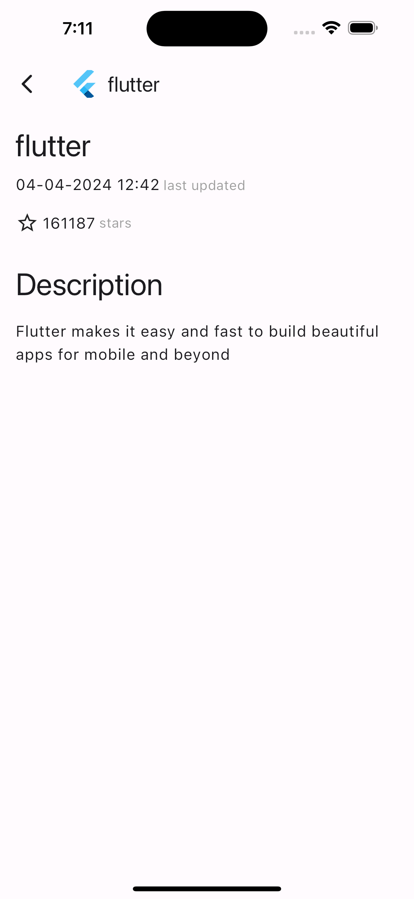

# About

A simple Flutter app that displays Flutter git repos fetched from Github API using Riverpod.

#### Installation

In the command terminal, run the following commands:

    $ git clone https://github.com/Jashem/bs23_task.git
    $ cd bs23_task
    $ flutter run

# Features 🎯

- The 'Home' screen displays flutter git repos with pagination
- The repos can be sorted by stars or updated
- Selected sorting persists through app sessions
- Clicking on any repo card navigates the user to the "Repo Details" screen
- Implemented state management using Riverpod
- Utilized a component-wise design pattern to promote code modularity and reusability
- Fetched github data using HTTP requests from Github API using dio package
- Made the app for offline browsing

### Download

#### Get it on Google Drive

<div>
<a href='https://drive.google.com/file/d/12R4P1B_X_k-q-YgNMCASLfngEIYqkzG4/view?usp=sharing' target='_blank'></a>
</div>

## Project Config Roadmap

All the necessary config and dependencies have already been set and ready for use but there is an explanation of each step if you want to know more about the pre-config or customize it.

Initialize the Flutter project, add all the necessary dependencies mentioned above in the **pubspec.yaml** configuration file and run `pub get`.

**pubspec.yaml**

```yaml
dependencies:
  flutter:
    sdk: flutter
  cupertino_icons: ^1.0.6
  auto_route: ^8.0.3
  dio: ^5.4.2+1
  freezed_annotation: ^2.4.1
  json_annotation: ^4.8.1
  dartz: ^0.10.1
  flutter_riverpod: ^2.5.1
  material_design_icons_flutter: ^7.0.7296
  cached_network_image: ^3.3.1
  shimmer: ^3.0.0
  intl: ^0.19.0
  sembast: ^3.7.1
  path_provider: ^2.1.2
  path: ^1.9.0
  collection: ^1.18.0

dev_dependencies:
  flutter_test:
    sdk: flutter
  flutter_lints: ^3.0.2
  build_runner: ^2.4.9
  auto_route_generator: ^8.0.0
  freezed: ^2.4.7
  json_serializable: ^6.7.1
```

#### Screenshots

<table>
    <tr>
        <td></td>
        <td></td>
    </tr>
    <tr>
        <td></td>
        <td></td>
    </tr>
</table>
